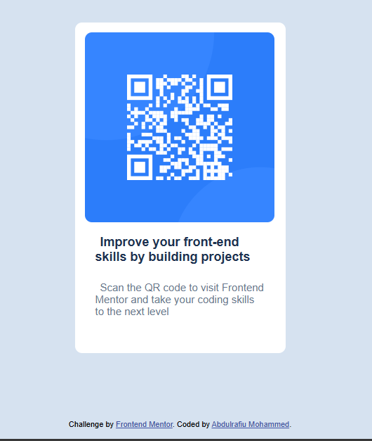

# Frontend Mentor - QR code component solution

This is a solution to the [QR code component challenge on Frontend Mentor](https://www.frontendmentor.io/challenges/qr-code-component-iux_sIO_H). Frontend Mentor challenges help you improve your coding skills by building realistic projects. 

## Table of contents

- [Overview](#overview)
  - [Screenshot](#screenshot)
  - [Links](#links)
- [My process](#my-process)
  - [Built with](#built-with)
  - [What I learned](#what-i-learned)
  - [Continued development](#continued-development)
  - [Useful resources](#useful-resources)
- [Author](#author)


## Overview

This is basically, my screenshot, links to the solution, process, nad i just want to say i felt and still feel good after completing this project. I just want to thank the group at frontend mentor, your team is really doing a nice job, and you're inspiring me, and lots more of developers out there, so a big THANK YOU!!, on my account and on their behalf.

### Screenshot

()

### Links

- Solution URL: [Add solution URL here](https://your-solution-url.com)
- Live Site URL: [Add live site URL here](https://your-live-site-url.com)

## My process

- So i started by creating the variables, and then the background color(body). 
Then i started styling the container and everything came in nicely.

### Built with

- Semantic HTML5 markup
- CSS custom properties
- Flexbox
- SASS
- google fonts (for the fonts).

### What I learned

i learnt how to do a little inline indentation.

```html
<h3>improve your front-end skills<h3>

```sass
.b-text
    text-indent: 7px

```

### Continued development

i'd like to focus more on css flexbox, and grid system. And also line indentation.

### Useful resources

-[chatGPT], helped me explain how i could use the "text-indent", by giving this example 
(
    p {
    text-indent: 1em;
}
)

## Author

- youtube - [CodeWithMe](www.youtube.com/@Rafman01)
- Frontend Mentor - [@Rafman0](https://www.frontendmentor.io/profile/Rafman0)